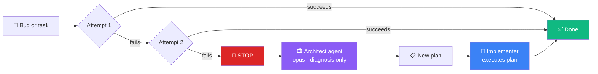

<div align="center">

# claude-code-setup

[](LICENSE)
[](https://docs.anthropic.com/en/docs/claude-code)
[](#the-story)

> If [claude-code-best-practice](https://github.com/shanraisshan/claude-code-best-practice) is the encyclopedia, this is the field guide.

An opinionated, production-tested Claude Code configuration for solo developers managing multiple apps.<br>
Not a tutorial — a real setup that runs daily across 10+ personal projects,<br>
shared so you can steal the parts that work for you.

</div>

---

**[The Story](#the-story)** · **[What's Inside](#whats-inside)** · **[Key Decisions](#key-decisions)** · **[Quick Start](#quick-start)** · **[Adapting](#adapting-to-your-setup)** · **[Philosophy](docs/philosophy.md)**

---

## The Story

I'm not a developer. I've spent 20 years close to code without writing much of it — I understand architecture, I can debug a concept, but I don't read diffs. I haven't looked at a line of code in my projects for months.

What I do is build things. I maintain a portfolio of 10+ personal apps — budget trackers, reading lists, encyclopedias, games, tools for my family. Different stacks, different audiences, different deployment targets. One development environment: Claude Code.

After months of trial, error, and way too many hours watching Claude Code attempt the same failing fix for the fifth time, I built a system. Commands that orchestrate agents. Agents that remember what they learned. Skills that preload project conventions. Hooks that nudge without blocking.

This repo is that system, anonymized and documented. It's opinionated because opinions are what's missing from most "best practices" repos — I'll tell you what I chose *and why I chose it over the alternative*.

As Boris Cherny, who created Claude Code, [put it](https://x.com/bcherny/status/2021699851499798911): "Every engineer uses their tools differently." This is my way.

## What's Inside

```
┌───────────────────────────────────────────────────────────┐
│                    You type a command                     │
│           /fix  /sync  /audit  /architect  ...            │
└─────────────────────────────┬─────────────────────────────┘
                              │
                              ▼
┌───────────────────────────────────────────────────────────┐
│                          Agents                           │
│                                                           │
│  implementer ──── sonnet (simple) / opus (complex)        │
│  architect ────── opus only (diagnoses, never codes)      │
│  docs-checker ─── sonnet (audits README, CLAUDE.md)       │
│  portfolio-sync ─ sonnet (cross-repo coherence)           │
│  portfolio-audit  haiku (compliance checks)               │
│  dev-scanner ──── sonnet (discovers & inventories)        │
│                                                           │
│  ┌────────────┐  ┌──────────────────────────────────┐     │
│  │   Memory   │  │  Skills (preloaded knowledge)    │     │
│  │ per agent  │  │  • portfolio-conventions         │     │
│  │ per project│  │  • code-quality                  │     │
│  └────────────┘  └──────────────────────────────────┘     │
└─────────────────────────────┬─────────────────────────────┘
                              │
                              ▼
┌───────────────────────────────────────────────────────────┐
│                     Hooks (advisory)                      │
│                                                           │
│  doc-guard ─────── "Did you update the docs?"             │
│  build-check ───── "Any warnings left?"                   │
│  memory-reminder ─ "Save what you learned"                │
│                                                           │
│  All advisory — they nudge, never block.                  │
└───────────────────────────────────────────────────────────┘
```

> [!TIP]
> For a visual, interactive version of this architecture, [open the workflow guide](https://w2ur.github.io/claude-code-setup/workflow-guide.html).

<details>
<summary><strong>Commands (7)</strong> — entry points that orchestrate everything</summary>

<br>

| Command | What it does | When to use it |
|---------|-------------|----------------|
| `/fix` | Bug fix with agent memory + auto-escalation after 2 failures | Something's broken |
| `/sync` | Portfolio-wide manifest sync + JSON generation | Weekly maintenance |
| `/audit` | Parallel docs-checker + portfolio-audit | Before releases, compliance sweeps |
| `/architect` | Escalate to opus for structural diagnosis | Fix keeps failing, or upfront design needed |
| `/new-app` | Full scaffold with portfolio compliance from day one | Starting a new project |
| `/cleanup` | Stale plans, plugin audit, memory compaction | Weekly housekeeping |
| `/tech-debt` | Monthly triage → deep review → auto-fix safe items | Monthly health check |

</details>

<details>
<summary><strong>Agents (6)</strong> — the workers, each with a specific role and model</summary>

<br>

| Agent | Model | Memory | What it does | What it doesn't do |
|-------|-------|--------|--------------|--------------------|
| **implementer** |  →  | ✅ | Executes tasks with "done when" criteria | Architecture decisions |
| **architect** |  | ✅ | Diagnoses structural problems, produces plans | Write production code |
| **portfolio-sync** |  | — | Cross-repo coherence (manifests, JSON, docs) | Creative content |
| **docs-checker** |  | — | Audits + fixes README, CLAUDE.md, URLs | Compliance standards |
| **portfolio-audit** |  | — | Read-only compliance check (signature, secrets, tests) | Fix anything |
| **dev-scanner** |  | — | Discovers projects, detects drift, finds orphans | Modify files |

The model selection matters. I don't pay opus prices for a compliance check that haiku handles perfectly. And I don't trust sonnet with a migration that touches 8 files across 3 layers — that's opus territory.

</details>

<details>
<summary><strong>Skills (2)</strong> — preloaded knowledge, injected at startup</summary>

<br>

- **portfolio-conventions**: condensed version of cross-project standards (naming, signature, dark mode, docs, manifest format, quality gates, display order). Loaded into `architect` and `portfolio-sync`.
- **code-quality**: before/during/after checklist, common pitfalls, elegance check protocol. Loaded into `implementer`.

Why skills instead of just writing longer agent prompts? Because skills are reusable across agents, versionable independently, and don't bloat agents that don't need them.

</details>

<details>
<summary><strong>Hooks (3)</strong> — advisory nudges, never blocking</summary>

<br>

- **doc-guard** (PostToolUse → Write): nudges when you modify code without updating `.portfolio.yml` or docs
- **build-check** (Stop): verifies zero warnings after each agent completes
- **memory-reminder** (Stop): reminds the agent to save what it learned

Why advisory? Because in a system where I don't review code, I need Claude Code to exercise judgment — not pass a checklist. A blocking hook on a one-character typo fix is just noise. Advisory hooks maintain signal quality: the agent sees the nudge and decides whether it matters.

</details>

### The Global CLAUDE.md

The `CLAUDE.md` at the root is the backbone — ~180 lines of rules that apply to every project. The most important ones:

> [!IMPORTANT]
> **The 2-attempt rule.** After 2 failed attempts at the same fix, stop. No "let me just try one more thing." Escalate to the architect agent. This single rule saved me more hours than everything else combined.



> [!WARNING]
> **Bug triage before code.** When I report a bug, Claude Code must rule out environment issues first — stale cache, service worker, old build. The most common "bugs" in my portfolio weren't bugs at all.

> [!NOTE]
> **Docs in the same commit as code.** README, CLAUDE.md, and `.portfolio.yml` updates ship with the feature, not as an afterthought. If the commit changes behavior, it changes documentation.

**The elegance check.** Before presenting non-trivial work, pause and ask: "Is there a more elegant way?" I don't review code — Claude Code is the entire quality bar.

## Key Decisions

These aren't arbitrary choices. Each one came from a specific failure. Read [the full story](docs/philosophy.md) for the context behind each decision.

| Decision | Alternative I considered | Why I went this way |
|----------|------------------------|-------------------|
| 2 attempts then escalate | 3 attempts (Claude Code's natural tendency) | The 3rd attempt is almost always the same approach with minor variations. It wastes time and digs deeper into the wrong solution. |
| Architect never codes | Architect diagnoses and implements | When the same agent diagnoses and codes, it's biased toward solutions it can implement quickly rather than the right solution. |
| Advisory hooks, not blocking | Blocking hooks that fail the build | In a system where I never review code, I need AI that exercises judgment, not one that passes checklists. Blocking hooks on trivial changes are just noise. |
| Model selection per task | Always use the best model | Haiku is perfect for audits. Sonnet handles 80% of implementation. Opus is for architecture and complex cross-file work. Matching model to task is a quality decision, not just a cost one. |
| Agent memory over lesson files | Flat markdown files per project | Files had no structure, no auto-injection, no compaction. Agent memory is read at startup, written automatically after corrections, and split when it grows too large. |
| Skills as preloaded context | Dynamic tool calls | Skills need to be available before the agent starts thinking. Dynamic loading means the agent might not know what it needs to know when making its first decision. |
| One manifest per repo (.portfolio.yml) | Central inventory document only | Drift. A central doc goes stale the moment you rename an app. A manifest in the repo travels with the code and gets updated in the same commit. |

## Quick Start

> [!NOTE]
> The setup is fully modular — you can copy everything, cherry-pick individual pieces, or just read and adapt the patterns to your own system.

### Option A: Copy the whole system

```bash
git clone https://github.com/w2ur/claude-code-setup.git
cp -r claude-code-setup/commands/ ~/.claude/commands/
cp -r claude-code-setup/agents/ ~/.claude/agents/
cp -r claude-code-setup/skills/ ~/.claude/skills/
cp -r claude-code-setup/hooks/ ~/.claude/hooks/
cp -r claude-code-setup/rules/ ~/.claude/rules/
cp claude-code-setup/CLAUDE.md ~/.claude/CLAUDE.md
```

Then edit `CLAUDE.md` and the agent files to replace `w2ur`, `{portfolio-site}`, and other placeholders with your own values.

### Option B: Cherry-pick what you need

The setup is modular. Want just the escalation system? Copy `/fix`, the `implementer` agent, and the `architect` agent. Want just the maintenance workflow? Copy `/cleanup` and `/tech-debt`. Each piece works independently — the full system is better, but partial adoption works fine.

### Option C: Read and adapt

Browse the files, understand the patterns, and build your own version. The [philosophy doc](docs/philosophy.md) explains the "why" behind each choice — that's often more valuable than the "what."

## Adapting to Your Setup

<details>
<summary>This system was built for a very specific situation — here's how to adapt it to yours</summary>

<br>

**If you have 1-3 apps:** You don't need half of this. Drop `portfolio-sync`, `portfolio-audit`, `dev-scanner` — they exist because I have 10+ repos to keep in sync. Keep `/fix`, `/architect`, the two core agents, and the global `CLAUDE.md`. That alone is a massive upgrade over bare Claude Code.

**If you work in a team:** The escalation rules still apply — they're about AI behavior, not team size. The `implementer`/`architect` split actually maps well to teams where juniors implement and seniors review. The memory system needs thought, though — per-developer or shared? I haven't solved that one.

**If you have a different stack:** My skills are specific to my projects. Throw them out and write your own. The architecture (commands → agents → skills + hooks) doesn't care what language you write in.

**If you use a monorepo:** The `portfolio-sync` agent assumes separate repos. You'd need a monorepo-aware version. Everything else works as-is.

</details>

## What This Repo Does NOT Include

> [!CAUTION]
> - **Application code.** Zero lines of app code. Just configuration.
> - **Personal data.** Public apps are mentioned by name (they're live on the internet anyway). Private apps, personal URLs, and paths are anonymized.
> - **A universal solution.** This works for me. Parts of it will work for you. All of it, probably not — and that's fine.

## Maintenance

This repo stays in sync with my actual `~/.claude/` setup via a Python sync script that copies, anonymizes, and audits for data leaks. See [`scripts/`](scripts/) for details.

If something looks outdated, it probably means I changed my setup and haven't synced yet. Open an issue — it's a good nudge.

## Contributing

This is a personal setup, not a framework. I'm not accepting PRs that change the architecture or philosophy. But I welcome:

- **Bug reports:** if something is broken, inconsistent, or unclear
- **Questions:** open an issue, I'll answer and improve the docs
- **Adaptations:** if you built something interesting on top of this, I'd love to hear about it

## Related

- [claude-code-best-practice](https://github.com/shanraisshan/claude-code-best-practice) — the comprehensive reference (encyclopedic, community-maintained)
- [Anthropic's Claude Code docs](https://docs.anthropic.com/en/docs/claude-code) — official documentation
- [William Revah on LinkedIn](https://www.linkedin.com/in/williamrevah) — where I write about building apps with AI, cognitive biases, and whatever else I'm curious about

## License

[MIT](LICENSE) — copy, adapt, share. Attribution appreciated but not required.

---

<div align="center">

*Built by [William](https://william.revah.paris) — someone who doesn't read code but ships 10+ apps anyway.*<br>
*Read [the philosophy](docs/philosophy.md) for the full story.*

</div>
